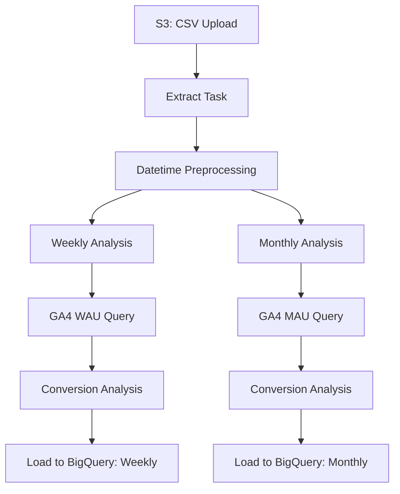

<br/>
<div align="center">
  <sub>
  본 레포지토리는 회원 데이터를 기반으로 한 <b>ETL 자동화 및 사용자 분석 파이프라인</b>을 정리한 개인 프로젝트입니다. Apache Airflow를 활용해 실무에서 반복되던 분석 업무를 자동화하고, 로그 기반 지표 분석까지 연결하는 흐름을 구현했습니다.  
  (This repository is a personal project that outlines an automated ETL and user analytics pipeline based on membership data. It leverages Apache Airflow to streamline repetitive analytical tasks and connects the workflow with log-based metric analysis.)
  </sub>  
</div>
<br/>
<br/>

---

# 🎯 PERSONAL_AIRFLOW

> **"데이터 흐름 전체를 자동화하고, 인사이트를 추출하다."**

이 프로젝트는 회원 데이터를 기반으로 한 **ETL 자동화 및 사용자 분석 파이프라인**입니다.
Airflow 기반의 DAG으로 구성되어 있으며, **AWS S3 → 데이터 전처리 → 분석 → BigQuery 적재** 전 과정을 자동화합니다.

또한 GA4 로그를 함께 활용하여, **서비스 참여도 지표(WAU/MAU)** 와 **전환율 분석**까지 연결합니다.

<br/>

---

## 🧩 구성 요소

* **Airflow DAG**: 전체 분석 흐름을 오케스트레이션 (`service_data_pipeline.py`)
* **S3 연동**: 멤버십 CSV를 로드하여 전처리
* **사용자 분석**: 가입, 결제, 이탈, 리텐션 지표 계산
* **GA4 기반 분석**: 외부 쿼리(`.sql`)를 통해 주요 지표 추출
* **BigQuery 적재**: 분석 결과를 주간/월간 테이블로 저장

<br/>

---

## 🗂 폴더 구조

```
PERSONAL_AIRFLOW/
├── dags/              # DAG 정의
│   ├── blog_data_pipeline.py
│   ├── blog_member_management.py
│   └── service_data_pipeline.py
├── queries/           # 외부 SQL (GA4 쿼리)
│   ├── mau_query.sql
│   └── wau_query.sql
├── scripts/           # 연결 초기화 스크립트
│   ├── init_airflow_connections.sh
├── config/            # 연결 정보 (예시)
├── auth/              # 인증 파일 (업로드 제외)
├── plugins/           # 커스텀 오퍼레이터 (옵션)
├── docker-compose.yaml
├── Dockerfile
├── entrypoint.sh
├── requirements.txt
└── README.md
```

> 해당 레포지토리에서는 `dags/`, `queries/`, `requirements.txt` 만을 포함했습니다.  

<br/>

---

## 🔁 데이터 흐름 구조도

실제 Airflow DAG 실행 결과:


<br/>

Mermaid 다이어그램으로도 정리하면 다음과 같습니다:


<br/>

### 💡 주요 태스크 요약 (task_id 기준)

| Task ID                  | 설명 |
|--------------------------|------|
| `extract`                | S3에서 일별 회원 CSV 데이터 로드 |
| `time_setting`           | 날짜 컬럼 정리 및 주/월 기준 컬럼 추가 |
| `weekly_user_analysis`   | 주차 기준 유저 지표 계산 (가입/유료/이탈 등) |
| `weekly_service_analysis`| GA4 로그 기반 WAU 분석 및 유저 데이터 병합 |
| `monthly_user_analysis`  | 월 기준 유저 지표 계산 |
| `monthly_service_analysis`| GA4 로그 기반 MAU 분석 및 병합 |
| `load_weekly_report`     | 주간 분석 결과 BigQuery 테이블에 저장 |
| `load_monthly_report`    | 월간 분석 결과 BigQuery 테이블에 저장 |


<br/>

---

## 🛠 기술 스택

<!--Python-->
 <!--Apache Airflow-->  <!--Amazon S3-->  <!--Google BigQuery-->  <!--Docker-->  <!--SQL-->  

<br/>
---

## 📦 추가 DAG 소개

### `blog_data_pipeline.py`
> 블로그 구독자(members)와 뉴스레터(posts) 데이터를 Ghost Admin API에서 수집하고,  
> 주간 단위로 주요 지표(가입자 수, 활성 유저 수, 구독률, 뉴스레터 클릭/오픈율 등)를 산출합니다.  
> - 수집된 데이터는 S3 및 BigQuery에 저장되어 추후 리포트 및 대시보드 구축에 활용됩니다.  
> - 한국어/영어 구독자를 분리하여 분석하며, 언어별 KPI를 병렬로 계산합니다.

### `blog_member_management.py`
> Ghost 블로그 멤버 시스템을 관리하는 자동화 파이프라인입니다.  
> - 비활성/스팸성 유저를 자동 삭제하고,  
> - BigQuery에서 추천된 보류(pending) 유저를 Ghost에 자동 생성합니다.  
> - Ghost 시스템과 BigQuery 테이블 간의 정합성을 주기적으로 맞추며 동기화를 수행합니다.

<br/>

---

## ✍️ 기획 의도

* 실무에서 반복되는 분석 업무를 더 효율적으로 다루기 위해, 개인적으로 워크플로우를 구성했습니다.
* Apache Airflow를 활용해 분석과 엔지니어링의 경계를 연결하고, 전체 흐름을 직접 설계하고 자동화해본 경험을 정리한 프로젝트입니다.
* 데이터 전처리부터 로그 기반 분석, 전환율 계산까지 **분석–엔지니어링 간 유기적인 흐름**을 고민하며 구성했습니다.
* 실무에서 익숙했던 Airflow 태스크 구조를 기반으로, **작업을 모듈화하고 유연하게 연결하는 방식**을 정제했습니다.
* 기존 코드를 돌아보며, **재사용성과 확장성**을 고려한 구조로 개선하는 데 중점을 두었습니다.


<br/>
<br/>
<br/>

---
<br/>
<br/>

# 🎯 PERSONAL_AIRFLOW

> **"Automate the entire data flow and extract insights."**

This project is a **user analysis pipeline with automated ETL**, built on top of Apache Airflow.
It covers the full flow from **AWS S3 → data preprocessing → analysis → BigQuery loading**.

Additionally, it incorporates GA4 logs to compute **engagement metrics (WAU/MAU)** and **conversion rates**.

<br/>

---

## 🧩 Components

* **Airflow DAG**: Orchestrates the entire analysis flow (`service_data_pipeline.py`)
* **S3 Integration**: Loads and preprocesses membership CSV data
* **User Analysis**: Calculates metrics such as signups, payments, churn, retention
* **GA4 Integration**: Runs external queries (`.sql`) to extract key engagement indicators
* **BigQuery Loading**: Stores results in weekly/monthly tables

<br/>

---

## 🗂 Project Structure

```
PERSONAL_AIRFLOW/
├── dags/              # DAG definitions
│   ├── blog_data_pipeline.py
│   ├── blog_member_management.py
│   └── service_data_pipeline.py
├── queries/           # External GA4 SQL queries
│   ├── mau_query.sql
│   └── wau_query.sql
├── scripts/           # Initialization scripts
│   └── init_airflow_connections.sh
├── config/            # Example config files
├── auth/              # Authentication files (excluded from repo)
├── plugins/           # Optional custom plugins
├── docker-compose.yaml
├── Dockerfile
├── entrypoint.sh
├── requirements.txt
└── README.md
```

> This repository includes only `dags/`, `queries/`, and `requirements.txt`.

<br/>

---

## 🔁 Data Flow Diagram

Actual Airflow DAG execution result:


<br/>

Alternatively, a Mermaid diagram representation:



<br/>

---

## 🛠 Tech Stack

      

<br/>

---

## 📦 Additional DAGs Overview

### `blog_data_pipeline.py`
> Collects blog members and newsletters data from the Ghost Admin API,  
> and calculates key weekly metrics such as subscriber count, active users, subscription rate, and newsletter engagement KPIs (open/click/delivery rates).  
> - Raw data is stored in both S3 and BigQuery, ready for use in dashboards or reporting pipelines.  
> - Data is processed separately for Korean and English audiences to provide language-specific insights.

### `blog_member_management.py`
> Automates management of the Ghost blog membership system.  
> - Inactive or low-engagement users are programmatically deleted,  
> - While new recommended (pending) users from BigQuery are automatically created in Ghost.  
> - Ensures data consistency between Ghost and BigQuery by running regular sync and upsert operations.

<br/>

---

## ✍️ Project Intent

* Designed to improve efficiency for repetitive analytics tasks frequently encountered in real-world scenarios.
* This is a self-directed project aimed at integrating analysis and engineering through Apache Airflow.
* Covers the full journey from preprocessing to log-based analysis and conversion rate calculation, focusing on **a cohesive data workflow**.
* Refines task orchestration using modular and maintainable patterns familiar from actual projects.
* Emphasizes **reusability and scalability** in structure while reflecting on and improving existing code.
