# 🎯 PERSONAL_AIRFLOW

> **"데이터 흐름 전체를 자동화하고, 인사이트를 추출하다."**

이 프로젝트는 회원 데이터를 기반으로 한 **ETL 자동화 및 사용자 분석 파이프라인**입니다.
Airflow 기반의 DAG으로 구성되어 있으며, **AWS S3 → 데이터 전처리 → 분석 → BigQuery 적재** 전 과정을 자동화합니다.

또한 GA4 로그를 함께 활용하여, **서비스 참여도 지표(WAU/MAU)** 와 **전환율 분석**까지 연결합니다.

---

## 🧩 구성 요소

* **Airflow DAG**: 분석 흐름 전반을 정의 (`Analysis_latest.py`)
* **S3 연동**: 멤버십 CSV를 로드하여 전처리
* **사용자 분석**: 가입, 결제, 이탈, 리텐션 지표 계산
* **GA4 기반 분석**: 외부 쿼리(`.sql`)를 통해 주요 지표 추출
* **BigQuery 적재**: 분석 결과를 주간/월간 테이블로 저장

---

## 🗂 폴더 구조

```
PERSONAL_AIRFLOW/
├── dags/              # DAG 정의
│   ├── analysis_latest.py
├── queries/           # 외부 SQL (GA4 쿼리)
│   ├── mau_query.sql
│   └── wau_query.sql
├── scripts/           # 연결 초기화 스크립트
│   ├── init_airflow_connections.sh
├── config/            # 연결 정보 (예시)
├── auth/              # 인증 파일 (업로드 제외)
├── plugins/           # 커스텀 오퍼레이터 (옵션)
├── docker-compose.yaml
├── Dockerfile
├── entrypoint.sh
├── requirements.txt
└── README.md
```

> 해당 레포지토리에서는 `dags/`, `queries/`, `requirements.txt` 만을 포함했습니다.  

---

## 🔁 데이터 흐름 구조도

실제 Airflow DAG 실행 결과:


Mermaid 다이어그램으로도 정리하면 다음과 같습니다:

```mermaid
graph TB
  A[S3: CSV 업로드] --> B[Extract Task]
  B --> C[Datetime 전처리]
  C --> D1[주간 분석]
  C --> D2[월간 분석]
  D1 --> E1[GA4 WAU 쿼리 실행]
  D2 --> E2[GA4 MAU 쿼리 실행]
  E1 --> F1[전환율 계산]
  E2 --> F2[전환율 계산]
  F1 --> G1[BigQuery 적재: Weekly]
  F2 --> G2[BigQuery 적재: Monthly]
```



---

## 🛠 기술 스택

<!--Python-->
 <!--Apache Airflow-->  <!--Amazon S3-->  <!--Google BigQuery-->  <!--Docker-->  <!--SQL-->  


---

## ✍️ 기획 의도

* 반복적인 분석 과정을 자동화하고 싶다는 필요에서 출발한 개인 프로젝트입니다.
* 데이터 전처리부터 로그 기반 분석, 전환율 계산까지 **분석-엔지니어링의 연결 흐름**을 고려해 구성했습니다.
* 실무에서 사용해온 Apache Airflow를 활용하여, **태스크 단위로 나누고 연결하는 방식**을 정제하고자 했습니다.
* 기존 코드와 흐름을 돌아보며, **재사용성과 확장성을 고려한 구조로 개선**하는 데 중점을 두었습니다.
<br/>
<br/>
<br/>

---
<br/>
<br/>

# 🎯 PERSONAL_AIRFLOW

> **"Automating the full flow of data—from raw logs to business insights."**

This project implements an automated **data pipeline and user analytics workflow** based on membership data.
Using Apache Airflow, it processes CSV files from **AWS S3**, performs time-based transformations, computes **weekly/monthly user metrics**, and stores results in **Google BigQuery**.

In addition, it integrates GA4 log data through external SQL queries to track **WAU/MAU** and **conversion trends**.

---

## 🧩 Key Components

* **Airflow DAG**: Full pipeline orchestration (`Analysis_latest.py`)
* **S3 Integration**: Loads raw membership CSV files
* **User Analytics**: Tracks signup, payment, churn, and retention KPIs
* **GA4 Insights**: Uses prewritten `.sql` queries to extract behavioral metrics
* **BigQuery Load**: Uploads results to weekly/monthly analytics tables

---

## 🗂 Folder Structure

```
PERSONAL_AIRFLOW/
├── dags/              # DAG definition
├── queries/           # External SQL queries (GA4)
├── scripts/           # Initialization scripts
├── config/            # Connection setup (example)
├── auth/              # Authentication (excluded)
├── plugins/           # Custom operators (optional)
├── docker-compose.yaml
├── Dockerfile
├── requirements.txt
└── README.md
```

---

## 🔁 Data Flow Diagram


---

## 🛠 Tech Stack
  
<!--Python-->
 <!--Apache Airflow-->  <!--Amazon S3-->  <!--Google BigQuery-->  <!--Docker-->  <!--SQL-->  

---

## ✍️ Project Motivation

* This project started from a personal need to automate repetitive data analysis tasks.
* It covers the entire flow from data preprocessing to log-based analysis and conversion rate calculation, aiming to **bridge the gap between analytics and engineering**.
* Using Apache Airflow—previously applied in real-world tasks—I focused on organizing the process into clear, task-oriented steps.
* Throughout the project, I aimed to **refactor the workflow with a focus on reusability and scalability**, while reflecting on and improving past implementations.
